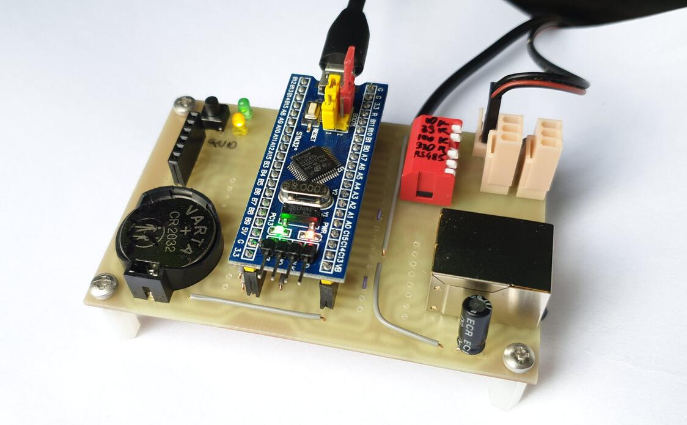
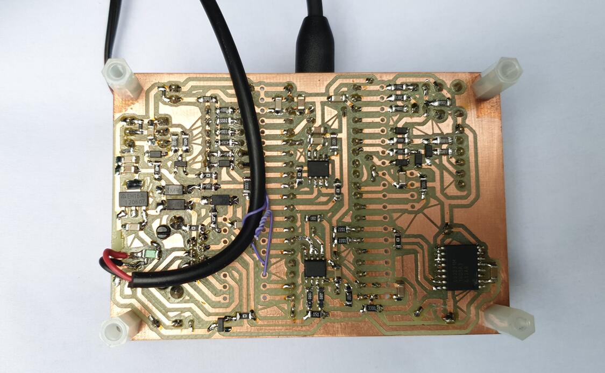

# Electricity meter
An STM32-based datalogger for electricity meters with pulse LED.

This repository contains both the PCB design files and firmware source code.




## Features
- detecting pulses of LED more than 100 mm away from the sensor,
- dynamic adjustment of bright / dark threshold,
- logging over one year of 1 minute resolution data to SPI flash,
- command line interface for debugging and reading logged data over USB CDC,
- support for RS485 communication.


## Building
### Hardware
I milled the single sided PCB on my [CNC machine](https://github.com/ondras12345/CNC).

Some notes:
- The DCF-3850N connector is only there for future-proofing. I don't currently
  use it and never tested it.
- The onewire bus connector is currently unused, but it should be easy enough
  to add DS18B20 temperature sensors.
- DS3231 RTC is necessary because the internal RTC on my STM32F103 was not
  accurate enough. Cut JP1 (battery power to STM32 VBAT) if you decide to use
  it too.
- The micro USB connector was a bad idea. I ended up replacing it with wires
  soldered directly to the board after accidentally breaking it off several
  times.

### Firmware
```sh
make help  # show available commands
make  # build
make check  # run cppcheck
```

For uploading to the STM32 via STlink, I use `tools/mkbin` and
`tools/upload_latest`.
